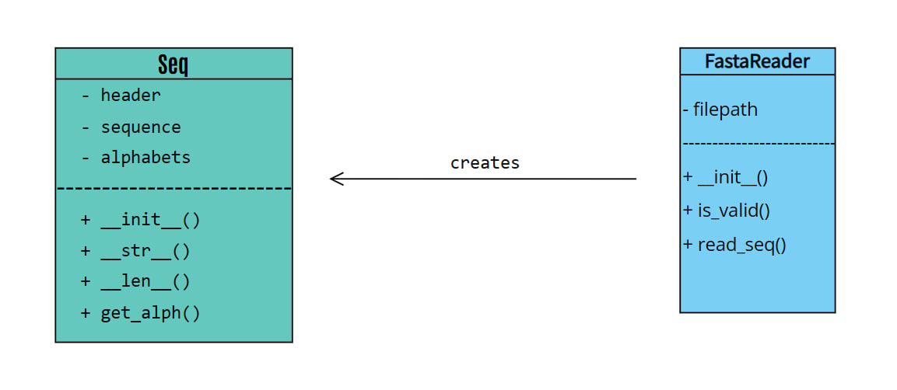

# FASTA Reader

Python библиотека для чтения FASTA файлов с биологическими последовательностями.

## О проекте

Проект реализует два класса:
- **Seq** - для работы с отдельными последовательностями
- **FastaReader** - для чтения FASTA файлов

## UML Диаграмма классов



*Диаграмма показывает отношения между классами Seq и FastaReader*

### Класс Seq
Представляет биологическую последовательность.

Атрибуты:

header (str): Заголовок последовательности

sequence (str): Биологическая последовательность

## Методы:

__len__(): Возвращает длину последовательности

get_alphabet(): Определяет тип последовательности ('nucleotide', 'protein', 'unknown')

### Класс FastaReader
Чтение и парсинг FASTA файлов.

## Методы:

is_valid_fasta(): Проверяет корректность формата файла

read_sequences(): Генератор для чтения последовательностей (оптимизация памяти)


### Структура проекта

fasta_reader/
├── seq_reader.py          # Основные классы Seq и FastaReader
├── demo.py               # Демонстрационная программа
├── create_test_files.py  # Генератор тестовых данных
├── requirements.txt      # Зависимости проекта
├── README.md            # Документация
├── .gitignore
├── LICENSE
├── INTRODUCTIONS.md
├── uml_diagram.jpg      # UML диаграмма классов
├── docs/                # Исходники документации
│   ├── source/
│   └── build/html/      # Собранная документация
└── test_fasta.py        # Тестовые FASTA файлы

## Возможности

- **Чтение FASTA файлов** любого размера
- **Автоматическое определение** типа последовательности (нуклеотидная/белковая)
- **Валидация формата** FASTA файлов
- **Генераторы** для эффективной работы с памятью
- **Полная документация** в формате HTML

## Установка

### Требования
- Python 3.8 или выше
- Установленный pip

### Установка зависимостей
```bash
pip install -r requirements.txt

## Быстрый старт

```bash
# Демо
cd demo && python demo.py

# Тесты
cd tests && python test_fasta.py

